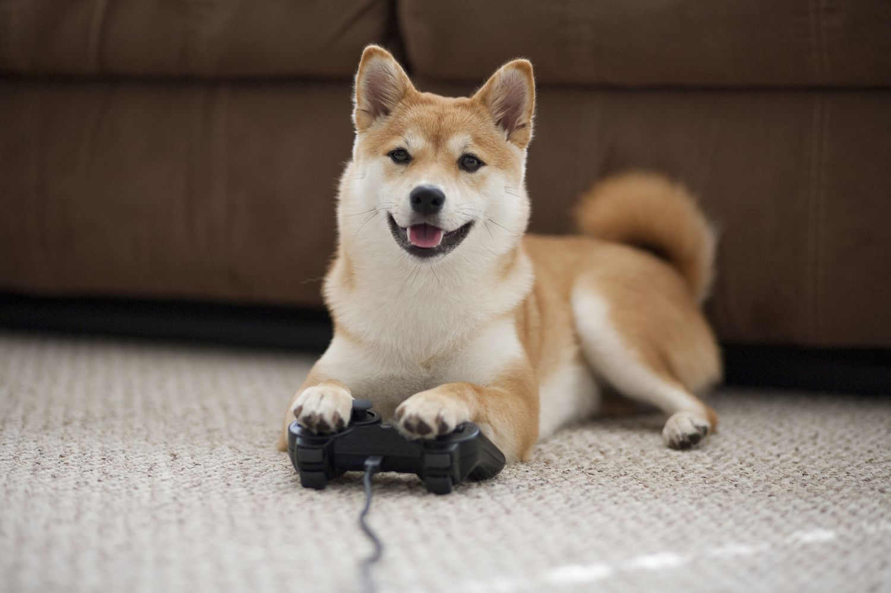

# raspberry-pi-ollama

## Install Ollama
Use the command below to install Ollama CLI:
```{bash}
curl https://ollama.ai/install.sh | sh
```
Use the command below to install Ollama Python Package:
```{bash}
git clone https://github.com/ollama/ollama-python
cd ollama-python
pip install .
```

## Small(er) Models
0. Llama 3.2 Family - ***OPTIMAL***

llama3.2:1b - **1.3 GB**
```{bash}
ollama run llama3.2:1b
```
llama3.2:3b - **2.0GB**
```{bash}
ollama run llama3.2:3b
```

1. TinyLlama - **637 MB**
* Text-only model
```{bash}
ollama run tinyllama
```

2. Phi - **1.6GB**
* Text-only model
```{bash}
ollama run phi
```

3. Llava - **4.7GB**
* Vision enabled - analyze image in given path
```{bash}
ollama run llava
```
Example:
Path: ./img/image.png

```{bash}
ollama run llava
>>> describe this image ./img/image.png
Added image './img/image.png'
 The image shows a Shiba Inu dog, commonly known as "Doge," sitting on a carpeted floor. The dog is looking upwards with a smile, and its tongue is slightly out. It 
has a relaxed posture with one paw extended towards a small black video game controller lying next to it. Behind the dog, there is a blurred background which 
suggests an indoor setting with furniture. The style of the image is a straightforward pet photograph with a focus on the dog's expression and activity. 
```

---

## Deployment
Use the `./llm.py` script - as an example python code, run it via:
```{bash}
python llm.py
```